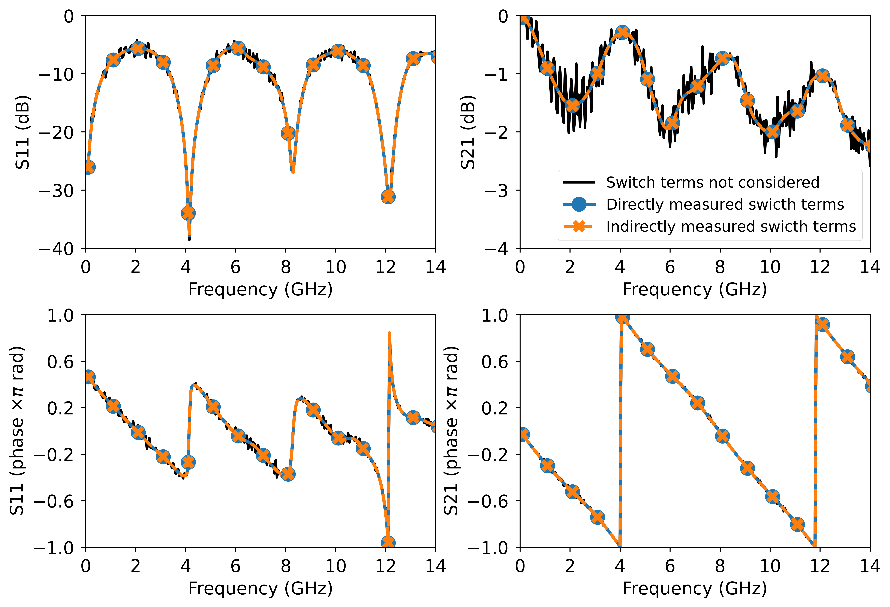

# VNA Switch Terms

Switch terms are reflections that occur due to imperfect matching of the termination of the non-driving port of a VNA. For an N-port VNA, there are N switch terms. The term "switch terms" originated from the fact that the terminations are usually integrated within the switches. Personally, I believe it would be more accurate to call it "port termination error" or something similar, but I will use the term "switch terms" as it is commonly known.

 | 
:--: | :--:
*Three-sampler VNA architecture (port 1 driving).* |*Four-sampler VNA architecture (port 1 driving).*

In this repository, I present an interesting technique for determining switch terms using only three receivers of a VNA (left image above). Although most modern VNAs are based on a four-sampler architecture (right image above), it is noteworthy that switch terms can be measured without using the fourth receiver or prior SOLT calibration. This method requires only three reciprocal devices.

If you want to learn more about switch terms, I have post all about it: <https://ziadhatab.github.io/posts/vna-switch-terms/>

## How it works

I will not discuss the details here, but you can check the math yourself in [1] (it is quite straightforward). Instead, I will highlight a few practical things that could help you avoid unnecessary pitfalls.

1. Ensure that the S-parameters you are measuring are ratios of the wave parameters. This is typically the default for many VNA vendors, but it is always a good idea to double-check by comparing the $S_{ij}$ with its corresponding ratio $S_{ij} = b_i/a_j$ when port-j is driving.

2. Make sure that all calibration on the VNA is off. If any calibration is on, you are not reading raw data from the receivers. As a result, the switch terms you measure using the method presented here would look different from the ones you measure directly from the VNA as wave ratios.

3. You need at least three unique transmissive reciprocal devices that can transmit. To meet this requirement, you can use resistive loads in an asymmetric configuration and measure them twice by flipping them. The third measurement can be a thru connection. The quality of the measured switch terms depends on the uniqueness of the reciprocal devices, which relate to the conditioning of the system matrix below.

Assuming you have measurements from at least three good reciprocal devices, you can measure the switch terms by solving the following system of equations:

$$
\begin{bmatrix}
  -S_{11}^{(1)}\frac{S_{12}^{(1)}}{S_{21}^{(1)}} & -S_{22}^{(1)} & 1 & \frac{S_{12}^{(1)}}{S_{21}^{(1)}}\\\
  \vdots & \vdots & \vdots & \vdots\\\
  -S_{11}^{(M)}\frac{S_{12}^{(M)}}{S_{21}^{(M)}} & -S_{22}^{(M)} & 1 & \frac{S_{12}^{(M)}}{S_{21}^{(M)}}
\end{bmatrix}\begin{bmatrix}
\Gamma_{12}\\\
c\Gamma_{21}\\\
c\\\
1
\end{bmatrix} = \boldsymbol{0}
$$

where $M\geq 3$ is the number of measured reciprocal devices, and $S_{ij}$ are the measured S-parameters. The switch terms, $\Gamma_{21}$ and $\Gamma_{12}$, can be found through the nullspace of the system matrix, which can be solved using SVD (see the code below).

## Code snippet

Normally, I wouldn't include an entire algorithm as a code snippet since they tend to be lengthy. However, in this case, the code is quite simple. You will need to have [`numpy`][numpy] and [`scikit-rf`][skrf] installed in your Python environment.

```python
import numpy as np
import skrf as rf

def compute_switch_terms(S):
    """
    S: is a list of skrf networks
    """
    Gamma21 = []  # forward switch term
    Gamma12 = []  # reverse switch term 
    for inx in range(len(S[0].frequency.f)): # iterate through all frequency points
        # create the system matrix
        H = np.array([ [-s.s[inx,0,0]*s.s[inx,0,1]/s.s[inx,1,0], -s.s[inx,1,1], 1, s.s[inx,0,1]/s.s[inx,1,0]] for s in S ])
        _,_,vh = np.linalg.svd(H)    # compute the SVD
        nullspace = vh[-1,:].conj()  # get the nullspace        
        Gamma21.append(nullspace[1]/nullspace[2])  # that is all
        Gamma12.append(nullspace[0]/nullspace[3])

    return np.array(Gamma21), np.array(Gamma12)

if __name__ == '__main__':
    # three reciprocal devices (or more...)
    stand1 = rf.Network('stand1.s2p')
    stand2 = rf.Network('stand2.s2p')
    stand3 = rf.Network('stand3.s2p')
    Gamma21, Gamma12 = compute_switch_terms([stand1, stand2, stand3, ])

# EOF
```

## Measurements

Here are the switch terms measured directly from a four-sampler VNA (R&S ZVA) and indirectly with the help of three reciprocal devices, while ignoring the fourth receiver of the VNA.


*Comparison of direct and indirect measurements of the switch terms.*

Additionally, I performed a multiline TRL calibration to demonstrate the difference that can occur when switch terms are not taken into consideration. For more information on the test board, please check [https://github.com/ZiadHatab/SMA-PCB-mTRL-kit](https://github.com/ZiadHatab/SMA-PCB-mTRL-kit).


*Results of the multiline TRL calibrated stepped impedance line.*

## References

[1] Z. Hatab, M. E. Gadringer and W. Bosch, "Indirect Measurement of Switch Terms of a Vector Network Analyzer With Reciprocal Devices," in _IEEE Microwave and Wireless Technology Letters_, vol. 33, no. 11, pp. 1588-1591, Nov. 2023, doi: [10.1109/LMWT.2023.3311032](https://doi.org/10.1109/LMWT.2023.3311032).


[numpy]: https://github.com/numpy/numpy
[skrf]: https://github.com/scikit-rf/scikit-rf
